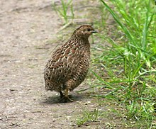

# Pendahuluan

## Mengenal Usaha Peternakan Puyuh

Burung puyuh merupakan unggas berukuran sedang yang sering dibudidayakan.
Ada seni tersendiri untu dapat beternak burung puyuh agar sukses.
Selain modal, beberapa kemampuan juga diperlukan untuk menjadi seorang peternak puyuh.
Siklus hidupnya yang cukup singkat, membuat beterna puyuh tak hanya pada satu fase.
Pengetahuan untuk beberapa fase (penetasan, pembesaran dan produksi) juga perlu dimiliki oleh seorang peternak puyuh.

Dalam buku ini, akan dijelaskan secara rinci mengenai hal-hal apa saja yang diperlukan untuk menjadi seorang peternak, khususnya peternak puyuh.
Buku ini akan bercerita mulai dari proses penetasan, pembesaran dan produksi.
Tak hanya itu, buku ini akan secara lengkap menjelaskan tentang cara pembuatan kandang,
desain kandang dan manajemen kandang.
Juga, dalam buku ini akan dijelaskan tentag tips-tips penting dalam memelihara puyuh.
Karena, setiap puyuh yang sehat akan menghasilkan telur yang banyak.

Dalam buku ini burung puyuh yang dipelihara adalah burung puyuh petelur.
Beberapa hal mungkin sedikit berbeda dengan puyuh pedaging.
Telur puyuh lebih diminati daripada danging puyuh,
itulah mengapa dalam buku ini fokus pada puyuh petelur.
